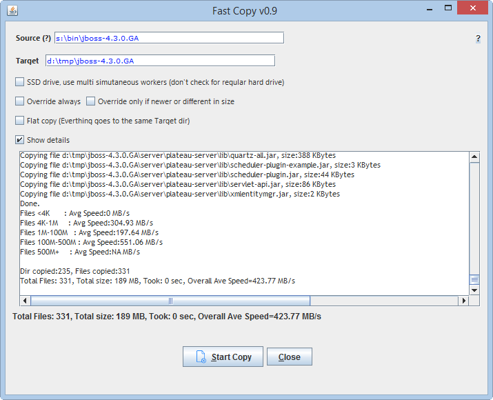
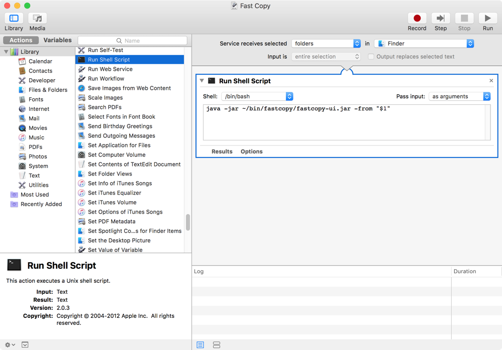

## Fast File and Directory Copy

* Copies files and directories fast

## Download

- [Downlod the latest release] (https://github.com/mhisoft/fastcopy/releases)

## How to run

* If not already, down load and install the latest JRE/JDK 1.7+ from Oracle.
* Exploded the downloaded zip into a directory and add the directory to the system path. 
* Windows: run the fc.bat, fc.exe or  fastcopy-console.exe for the UI version. 
* Mac OS: put in the Applications and run.
* Unix/linux : run the fc.sh, fc.sh script.

## Hook to the Windows Explorer Context menu
- Edit the fastcopy_reg.reg file change the path to point to where your rdpro is exploded.
double click to import into windows registry

## Add to the Mac Finder's Context menu 
* Follow the below Automator screeshot to add the Automator, Service. Edit the path to where you installed the jar if needed. 

 

## Disclaimer
The author is not responsible for any loss of files or damage incurred by running this utility.

## License
Apache License 2.0, January 2004 http://www.apache.org/licenses/
